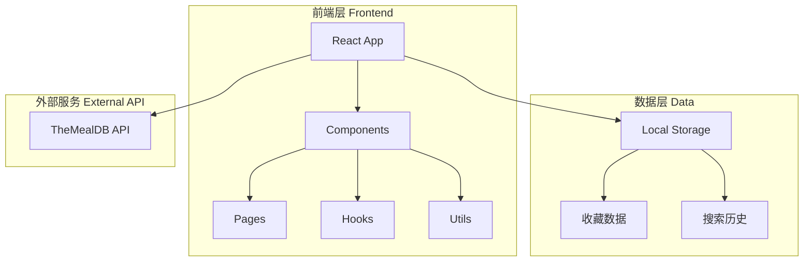

# 食谱小程序 - 技术架构文档

## 1. 架构设计



## 2. 技术说明

### 2.1 技术栈
- **前端框架**：React 18 + TypeScript
- **样式方案**：Tailwind CSS 3
- **构建工具**：Vite
- **路由管理**：React Router 6
- **状态管理**：React Context + useReducer
- **HTTP 请求**：Fetch API
- **图标库**：Lucide React

### 2.2 第三方 API
**TheMealDB API** (https://www.themealdb.com/api.php)
- 免费开源食谱 API，无需 API Key
- 提供食谱搜索、分类、详情等接口

### 2.3 API 接口列表
| 接口名称 | URL | 用途 |
|----------|-----|------|
| 随机食谱 | `https://www.themealdb.com/api/json/v1/1/random.php` | 首页精选推荐 |
| 搜索食谱 | `https://www.themealdb.com/api/json/v1/1/search.php?s={keyword}` | 关键词搜索 |
| 分类列表 | `https://www.themealdb.com/api/json/v1/1/categories.php` | 获取所有分类 |
| 分类食谱 | `https://www.themealdb.com/api/json/v1/1/filter.php?c={category}` | 按分类筛选 |
| 食谱详情 | `https://www.themealdb.com/api/json/v1/1/lookup.php?i={id}` | 获取食谱详情 |
| 地区列表 | `https://www.themealdb.com/api/json/v1/1/list.php?a=list` | 获取所有地区 |
| 地区食谱 | `https://www.themealdb.com/api/json/v1/1/filter.php?a={area}` | 按地区筛选 |

## 3. 路由定义

| 路由 | 页面 | 描述 |
|------|------|------|
| `/` | 首页 | 精选食谱展示、分类导航 |
| `/category` | 分类页 | 所有分类列表 |
| `/category/:name` | 分类详情 | 指定分类的食谱列表 |
| `/search` | 搜索页 | 搜索功能和结果展示 |
| `/recipe/:id` | 详情页 | 食谱详细信息 |
| `/favorites` | 收藏页 | 收藏的食谱列表 |

## 4. 数据模型

### 4.1 食谱数据模型
```typescript
interface Meal {
  idMeal: string;
  strMeal: string;
  strMealThumb: string;
  strCategory?: string;
  strArea?: string;
  strInstructions?: string;
  strYoutube?: string;
  strSource?: string;
  ingredients?: Ingredient[];
}

interface Ingredient {
  name: string;
  measure: string;
}

interface Category {
  idCategory: string;
  strCategory: string;
  strCategoryThumb: string;
  strCategoryDescription: string;
}

interface Area {
  strArea: string;
}
```

### 4.2 本地存储数据模型
```typescript
interface LocalStorage {
  favorites: string[];
  searchHistory: string[];
}
```

## 5. 项目结构

```
src/
├── components/          # 通用组件
│   ├── Header.tsx       # 顶部导航
│   ├── Footer.tsx       # 底部导航（移动端）
│   ├── MealCard.tsx     # 食谱卡片
│   ├── SearchBar.tsx    # 搜索框
│   ├── CategoryTag.tsx  # 分类标签
│   ├── Loading.tsx      # 加载状态
│   └── EmptyState.tsx   # 空状态
├── pages/               # 页面组件
│   ├── Home.tsx         # 首页
│   ├── Categories.tsx   # 分类页
│   ├── CategoryDetail.tsx # 分类详情
│   ├── Search.tsx       # 搜索页
│   ├── RecipeDetail.tsx # 详情页
│   └── Favorites.tsx    # 收藏页
├── hooks/               # 自定义 Hooks
│   ├── useMeals.ts      # 食谱数据获取
│   ├── useFavorites.ts  # 收藏管理
│   └── useSearchHistory.ts # 搜索历史
├── context/             # 状态管理
│   └── AppContext.tsx   # 全局状态
├── services/            # API 服务
│   └── mealApi.ts       # API 封装
├── types/               # 类型定义
│   └── index.ts         # 类型导出
├── utils/               # 工具函数
│   └── storage.ts       # 本地存储
├── App.tsx              # 根组件
├── main.tsx             # 入口文件
└── index.css            # 全局样式
```

## 6. 性能优化策略

1. **图片懒加载**：使用 Intersection Observer 实现图片懒加载
2. **请求缓存**：对已请求的数据进行内存缓存
3. **防抖搜索**：搜索输入防抖 300ms
4. **虚拟列表**：长列表使用虚拟滚动（如需要）
5. **代码分割**：路由级别代码分割
